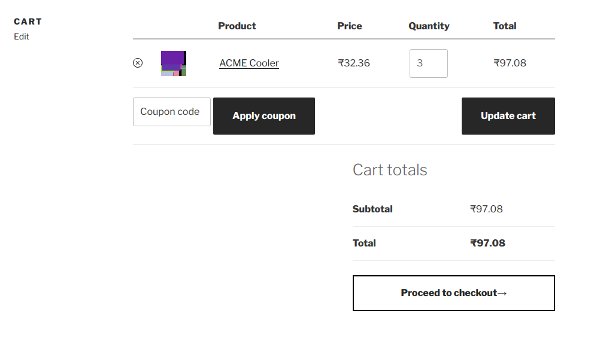
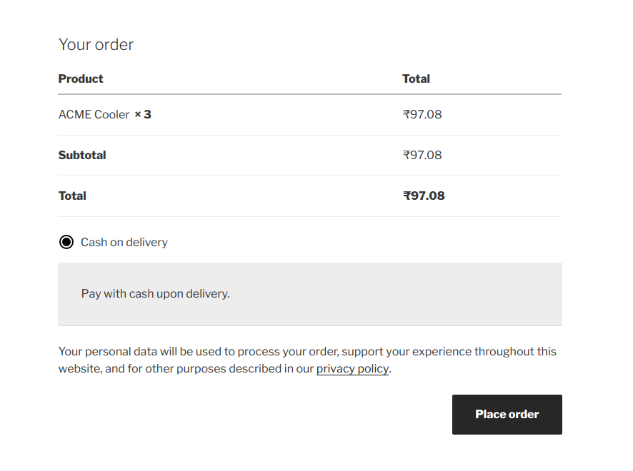
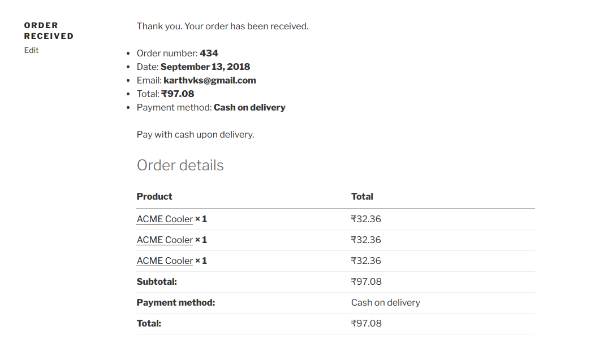

<h1> HACK #3 - Split product with multiple qty in cart into seperate order items after order is placed.</h1>


<p><b>Check the plugin code for usage.</b></p>

>`Don't get overwhelmed! Most of the file in this repo is related to unit testing or integrated build`.

<br/>
<strong>Following files are all need to get this running : </strong>

```
split-multiple-qty-order-item-on-checkout/
├── class-split-multiple-qty-order-item-on-checkout.php   (your intrested code)
└── init.php                                     (plugin main file)

```

**Main Action -**
```php
//loc: woocommerce/includes/class-wc-checkout.php
do_action( 'woocommerce_checkout_create_order_line_item', $item, $cart_item_key, $values, $order );
```
<hr>

<p style="text-align:center"><b>1. Cart page </b></center></p>



<hr>
<p style="text-align:center" ><b>2. Before placing order</b></p>




<hr>
<p style="text-align:center"><b>3. After order is placed</b></p>



<hr>